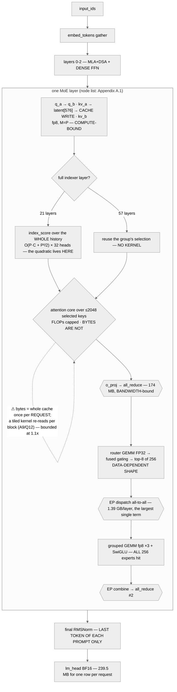
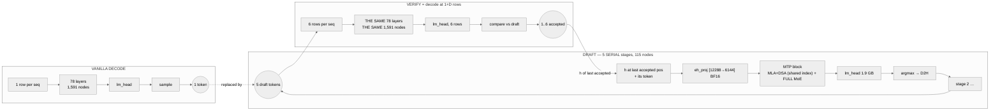

# GLM-5.2 — Working Design Note

**Predicted execution model for Z.ai GLM-5.2 on 8×H200 SXM, TP8 / EP8, FP8**

Built from the model repos' own files — `config.json` and
`model.safetensors.index.json` for both `zai-org/GLM-5.2` (bf16) and
`zai-org/GLM-5.2-FP8`, plus the vendor's published vLLM recipe for the deployment
shape. **No traces.** Every number is a roofline floor at vendor peak: a lower
bound on time, not a target.

Reproduce any figure here (against this branch — the planner is actively changing,
so check `git rev-parse HEAD` matches if a number disagrees):

```bash
gitm plan glm-5.2-fp8 --gpu H200 --batch 32 --kv-len 8192 --tp 8 --ep 8
gitm plan glm-5.2-fp8 --gpu H200 --batch 32 --kv-len 8192 --tp 8 --ep 8 --spec-tokens 5
gitm plan glm-5.2-fp8 --gpu H200 --prefill-tokens 8192 --batch 0 --kv-len 0 --tp 8 --ep 8
gitm plan glm-5.2-fp8 --gpu H200 --sweep 1,4,16,32,64,128,256 --kv-len 8192 --tp 8 --ep 8
gitm plan glm-5.2     --gpu H200 --batch 32 --kv-len 8192 --tp 8 --ep 8   # what bf16 costs
```

## Hardware assumption: 8×H200 SXM, NVLink, TP8 / EP8, FP8 weights and KV

Unlike a hardware assumption inferred from a checkpoint, **this one is the
vendor's own** — `recipes.vllm.ai/zai-org/GLM-5.2` publishes it verbatim. If
production differs, *graph topology does not change*; only these constants and
some bound labels do. Regions whose label would flip are marked ⚑ throughout.

| Constant             | Value used                        | Note                                                          |
| -------------------- | --------------------------------- | ------------------------------------------------------------- |
| FP8 e4m3 tensor peak | **1,979 TFLOP/s**                 | datasheet says 3,958 **"with sparsity"** — halved, see A2      |
| BF16 tensor peak     | **989.5 TFLOP/s**                 | same halving                                                   |
| FP32 CUDA-core peak  | **67 TFLOP/s**                    | the router runs here — see G4, and it is 3.4× the old default |
| HBM3e                | **4.8 TB/s**                      | as published                                                   |
| NVLink               | **900 GB/s** per GPU              | the catalogue's bidirectional convention                       |
| Memory               | 141 GB × 8 = 1,128 GB             | one node                                                       |
| Kernel launch        | ~2 µs graph-replay / ~5 µs eager  | ⚑ the crossover hinge — see §5 rank 3                         |

The recipe, verbatim, because every constant above and every bound label in §4
assumes it — and because §6.2's C6 ("the engine's launch arguments, as text") is
worth more than most of the traces:

```bash
vllm serve zai-org/GLM-5.2-FP8   --kv-cache-dtype fp8   --tensor-parallel-size 8   --speculative-config.method mtp   --speculative-config.num_speculative_tokens 5   --tool-call-parser glm47 --reasoning-parser glm45 --enable-auto-tool-choice
```

`--enable-expert-parallel` is **not** in it. §4 prices the EP8 shape anyway,
because it is the shape that makes the `moe_all_to_all` rows exist at all —
TP8-only removes them and doubles the per-rank expert bank instead. Which of the
two is running is capture C5, and it re-ranks the largest line in prefill.

```
FP8  ridge = 1,979e12 / 4.8e12 = 412 FLOP/byte
BF16 ridge =   989.5e12 / 4.8e12 = 206 FLOP/byte
FP32 ridge =      67e12 / 4.8e12 =  14 FLOP/byte
```

**You need all three.** The backbone GEMMs and the experts are FP8; `lm_head`,
`embed_tokens`, the MTP `eh_proj` and — the one worth naming — the **lightning
indexer** are BF16; the router is FP32. §1's precision table shows why, and G5 is
the planner change that made it representable.

---

## 1. Layer-by-layer architecture map

### Headline structure

| Property                    | Value                                                                    |
| --------------------------- | ------------------------------------------------------------------------ |
| Layers                      | **78** transformer + **1** MTP draft module                              |
| Attention                   | **MLA + DeepSeek Sparse Attention on every layer** — no schedule at all  |
| KV latent                   | `kv_lora_rank=512` + `qk_rope_head_dim=64` = **576 elems/token/layer**    |
| Indexer                     | 32 heads × 128 dim, keeps **`index_topk=2048`** positions for the core    |
| **IndexShare**              | **21 of 78 layers** compute the index; **57 reuse** a neighbour's         |
| Dense MLP                   | **3** — layers 0, 1, 2 (`first_k_dense_replace: 3`), `intermediate=12288` |
| MoE layers                  | **75** — layers 3–77, plus the MTP module                                |
| Experts / top-k             | 256 routed, top-8, **1 shared**, `moe_intermediate_size=2048`             |
| Routing                     | sigmoid scoring, `noaux_tc`, `routed_scaling_factor=2.5`, **fp32 router** |
| hidden_size                 | 6144                                                                     |
| Q heads / q_lora / kv_lora  | 64 / 2048 / 512                                                          |
| qk_nope / qk_rope / v_head  | **192 / 64 / 256** — the value width differs from the score width         |
| RoPE                        | θ=8e6, `rope_interleave`, `indexer_rope_interleave`                       |
| MTP                         | 1 module, `index_share_for_mtp_iteration: true`, **carries a full MoE**  |
| Vocab                       | 154,880, untied `lm_head`                                                 |
| Max context                 | 1,048,576                                                                |
| Total / active params       | **744 B** published + a **9.9 B** MTP block / ~39 B active                |

### Semantics read from the checkpoint, not guessed

From `config.json`: `indexer_types[i]` is `"full"` (the layer computes its own
top-2048) or `"shared"` (it **reuses the previous `full` layer's top-k** — the
semantics `transformers` documents, verbatim); `mlp_layer_types[i]` is
`"dense"` | `"sparse"`, agreeing with `first_k_dense_replace: 3`; and
`moe_router_dtype: "float32"` makes the router fp32 **on every variant**, being a
field of the base config rather than of any quantisation config.

**The schedule is proven from the weight map, not inferred.** Indexer tensors
(`*.indexer.wq_b`, `.wk`, `.weights_proj`, `.k_norm`) exist on exactly the 21
`full` layers, on **none** of the 57 `shared` layers, and on **none** of the MTP
module. Pricing all 78 at full rate — the naive reading of `index_topk` —
overstates the indexer ~3.7×. (Z.ai publishes **2.9×** for
[IndexShare](https://huggingface.co/papers/2603.12201); that is whole-model
per-token FLOPs at 1M context, where 3.7× is the indexer's own ratio, 78 ÷ 21.)

Why "read verbatim" is not pedantry: this catalogue entry carried the schedule one
entry short for a while. Layer 77 took the modulo fallback, landed on `shared`,
and the count still came out 21 — the right answer from evidence that was not
there, with a byte-identical floor. The loader now refuses a short schedule.

Attention shapes, per token per layer:

| Quantity                 | Shape                | Purpose                                            |
| ------------------------ | -------------------- | -------------------------------------------------- |
| Q latent (`q_a`)         | 2048                 | replicated low-rank query                          |
| Q per-head (`q_b`)       | 64 × 256 = 16,384    | 192 nope + 64 rope                                  |
| **KV cache entry**       | **512 + 64 = 576**   | **one latent for all 64 heads** — the MLA point     |
| `kv_b` output            | 64 × (192+256) = 28,672 | reconstructed K_nope and V                       |
| Attention output         | 64 × 256 = 16,384    | one 256-d result per Q head                        |
| After `o_proj`           | 6,144                | back to `d_model`                                   |
| Index key (`full` only)  | 128                  | cached alongside the latent                        |

`num_key_value_heads: 64` is a **red herring**: a GQA reading gives 28,672
elements per token per layer against the real 576 — **50× on the single quantity
decode is bound by**.

### The 79-row table, collapsed to four archetypes

The 78 layers plus the draft module are exactly four shapes. Everything not listed
is byte-for-byte identical between them.

| Archetype | Count | Attn | Indexer  | MLP           | KV elems/tok | Collectives per layer |
| --------- | ----- | ---- | -------- | ------------- | ------------ | --------------------- |
| `Ld,f`    | **3** | MLA+DSA | **full** | dense 12288 | 576 + 128    | 2× all-reduce         |
| `Ls,f`    | **18**| MLA+DSA | **full** | MoE 256×2048 | 576 + 128   | 2× all-reduce (+2× a2a under EP) |
| `Ls,sh`   | **57**| MLA+DSA | shared   | MoE 256×2048 | 576         | 2× all-reduce (+2× a2a under EP) |
| `Lmtp`    | **1**, ×D | MLA+DSA | shared   | MoE 256×2048 | 576     | 2× all-reduce per stage |

`Ld,f` and `Ls,f` are both full-indexer archetypes — 3 + 18 = **21**, matching §1.
The transformer stack is 3 + 18 + 57 = **78**; `Lmtp` is a 79th block that exists
in the checkpoint and runs **only under a speculative config**, once per drafted
token (§3.3).

The two schedules do not line up — a 3-layer dense prefix, a 3-layer `full`
prefix, then an IndexShare period of 4 — so no single modulo rule reproduces
either, which is why both are read verbatim (§7, G3). And note the absences: no
sliding window, no compression schedule, no attention-type alternation, no
encoders. Every layer runs the same attention.

### Verification — three independent checks

| check | predicted | published | error |
| --- | --- | --- | --- |
| bf16 checkpoint | 1,508.1 GB | 1,506,659,919,872 B (282 shards) | **+0.08 %** |
| fp8 checkpoint | 755.9 GB | 753,329,940,480 B (141 shards) | **+0.34 %** |
| params, MTP block removed | **744.2 B** | **744 B** (Z.ai) | **+0.03 %** |

The third is the interesting one. The checkpoint is 753.3 B by its own bytes but
Z.ai publishes 744 B — the gap is the MTP block, which the published figure
excludes. So the block is **9.9 B**, where a *dense* draft head would be **0.23 B**:
the draft carrying a full 256-expert mixture (§2.4) is confirmed twice, once from
the weight map and once from arithmetic on a number published for another reason.

Two precisions agreeing to under half a percent also rules out sparsity — a
2:4-compressed checkpoint would be roughly half the fp8 size (A2).

### KV cache — the number that drives decode

```
per layer per token, elements:
  every layer   kv_lora_rank 512 + qk_rope 64 = 576   ← one latent, all 64 heads
  full-indexer layers, additionally         + 128   ← the cached index key

whole model, bytes per token of context (fp8 latent, bf16 rope key + index key):
  an fp8 weight costs 1.000244 B, not 1 B — the 128×128 block scale (§7.0)
  78 × (512×1.000244 + 64×2)  +  21 × 128×1.000244  =  52,618 B/token
  bf16 throughout:                                     95,232 B/token

  ⚠ 1.000244 is a *weight*-side constant borrowed for cache bytes. An fp8 KV
    cache carries a per-token or per-tensor scale, not 128×128 blocks, so the
    true figure is nearer 78×640 + 21×128 = 52,608. The 10-byte gap is 0.02%
    and moves nothing; it is named because the constant is the wrong one, not
    because the number is.
```

| Context | fp8 KV  | bf16 KV |
| ------- | ------- | ------- |
| 8,192   | 0.43 GB | 0.78 GB |
| 131,072 | 6.90 GB | 12.48 GB |
| 1,048,576 | **55.2 GB** | **99.9 GB** |

**Replicated, not sharded**: one shared latent cannot be split, so every rank
reads the whole cache — **TP buys no KV bandwidth here**. At 1M that is 55 GB per
rank on top of a 96 GB weight share, which is why the vendor recipe reaches for
B200s and `--max-num-seqs 32` for full context.

### FP8 — what is and is not quantized

| Component                                          | Precision                       | Evidence                                          |
| -------------------------------------------------- | ------------------------------- | ------------------------------------------------- |
| `q_a`/`q_b`/`kv_a`/`kv_b`, **`o_proj`**, dense FFN | **FP8 e4m3**, 128×128 block     | absent from `modules_to_not_convert`               |
| routed experts, shared expert                       | **FP8 e4m3**, 128×128 block     | absent from `modules_to_not_convert`               |
| `lm_head`, `embed_tokens`                           | **BF16**                        | named in `modules_to_not_convert`                  |
| **lightning indexer** — `indexers_proj`, `wq_b`, `wk`, `weights_proj` (+ `k_norm`) | **BF16** | named in `modules_to_not_convert`                  |
| MTP `eh_proj`, `enorm`, `hnorm`                     | **BF16**                        | named in `modules_to_not_convert`                  |
| MoE router (`mlp.gate` + `e_score_correction_bias`) | **FP32**                        | `moe_router_dtype: "float32"`, base config          |
| all norms                                           | **BF16**                        | named in `modules_to_not_convert`                  |

**Three precisions inside one attention block**, and the layout **inverts** the
familiar fp8-backbone pattern: here `o_proj` is *inside* the quantised set and the
*indexer* is outside it. Pricing the indexer at fp8 halves the weight traffic of
the one attention node whose cost grows with context — and at 1M context that node
is 54 % of the step (§4.1). This is why the planner grew
`op_dtype_overrides` (§7, G5).

---

## 2. Per-phase execution diagrams

### 2.1 Prefill — a chunk of P tokens against C cached



**The structural claim of prefill:** with 256 experts and top-8, a chunk of P
tokens issues `8P` token→expert assignments. Once `8P ≫ 256` — P above a few
hundred — every expert receives at least one token, so **every layer reads its
entire expert bank**, 1.26 GB per rank per layer at EP8, **constant in P**. That is
95.7 GB per pass, 23 % of all prefill traffic. But it is not the top line: **the EP
all-to-all is**, at 105.7 GB and 44 % of predicted prefill time. Three quarters of
prefill cost is the MoE path, and under expert parallelism most of that is *wire*,
not DRAM.

**And DSA inverts the usual prefill story.** In a dense model prefill attention is
the `O(P²)` term. Here the *core* is capped at 2,048 selected keys per query, so it
is linear in context past 2,048 — and the quadratic has moved into the **indexer
scan**, which IndexShare then pays on only 21 of 78 layers. `index_topk` bounds the
core's FLOPs in both phases; it does **not** bound its bytes at prefill (§2.2).

### 2.2 Decode — steady state, B sequences, one token each

Identical node set to prefill. Four nodes change **kind**:

| operator            | prefill class                         | decode class                                          | why the class itself changes                                         |
| ------------------- | ------------------------------------- | ----------------------------------------------------- | -------------------------------------------------------------------- |
| attention core      | tiled over query blocks, causal        | **paged decode attention** over a top-k block table    | one query row against a gathered selection; no tiling over queries    |
| indexer scan        | `O(P·C + P²/2)`, **compute-bound**    | `O(B·C)`, **memory-bound** — streams the whole key set | the query count collapses from P to B; the key set does not          |
| **attention bytes** | whole cache, once **per request**      | **top-2048 window, per sequence**                      | prefill queries' selections union to everything; one query's does not |
| every GEMM          | M = P ≈ 8192, compute-bound           | M = B, **weight-streaming**                            | AI falls ~1,400 → ~60; same kernel name, different regime            |
| collectives         | **bandwidth** — 174 MB, 30.5 ms wire  | **latency** — 688 kB, a ring floor                     | payload 250× apart; the EP a2a goes from the top line to 2.8 %       |
| `lm_head`           | one row per **request**               | **every row, every step**                              | the epilogue is free in prefill and is not in decode                 |

Plus one epilogue change: **in prefill only the last position of each prompt runs
`lm_head`. At decode every row is a last position**, so it reads 1.9 GB of bf16
vocabulary weights *every step* rather than once per request.

```
  [hidden BF16 B×6144]
        │
   RMSNorm ─▶ q_a fp8 (REPLICATED, 2048) ─▶ q_a_layernorm ─▶ q_b fp8 (64×256)
        │
   kv_a fp8 ─▶ latent[512] + rope key[64] ─▶ KV-cache APPEND (576 elems/seq)
        │
   ┌────┴─────────────────────────────────────┐
   │  full-indexer layer (21 of 78)?          │
   │    yes → wq_b/wk/gate BF16, then         │  ← the ONLY term that grows with S.
   │          score the WHOLE history         │    0.9 % of the step at 8K,
   │          B×C×128 bytes, 32 heads,        │    13.0 % at 128K, 54.4 % at 1M
   │    no  → reuse. NO KERNEL. (57 layers)   │
   └────┬─────────────────────────────────────┘
        │
   attention core over ≤2048 selected entries ·· 42 MB/layer — FLAT IN CONTEXT
        │                                          and NOT divided by TP
   o_proj fp8 (16384→6144)
        │
   all_reduce #1 ······························ 688 kB · LATENCY-bound [stream: unresolved]
        │
   RMSNorm ─▶ router GEMM FP32 ─▶ sigmoid+bias ─▶ top-8 of 256
        │
        ├─▶ per-expert histogram ─▶ ❓ D2H sync ❓ · S1 · 76/token if real · conf LOW
        │                                          ← the ONLY data-dependent shape
        │                                            in the graph. Blocks CUDA-graph
        │                                            capture. §5 rank 2.
   EP dispatch a2a ─▶ permute ─▶ grouped GEMM fp8 ×2 ─▶ SiLU ─▶ grouped GEMM fp8
        │             163/256 experts woken at B=32 · 771 MB/layer · 85 % of DRAM
   scatter-add ×2.5 ─▶ EP combine a2a ─▶ all_reduce #2
        ▼
   … ×78 layers, then:
   final RMSNorm (ALL B rows) ─▶ lm_head 1.9 GB BF16 ─▶ sample ─▶ D2H ─▶ scheduler gap
```

### 2.3 Encoders — there are none, and the absence is worth stating

GLM-5.2 is a **text-only** decoder: no vision tower, no audio encoder, no
multimodal scatter into `inputs_embeds`. The absence is load-bearing three times
over. **Prefill starts at `embed_tokens`** — the encoder→backbone seam that
dominates a multimodal prefill does not exist. **Prompt length is the only
input-side variable**, so §4.4 is one row shorter and the rest better constrained.
And **no second model is hiding off-checkpoint**, so every FLOP in a trace should
map to a node in §3 — which makes an unexplained kernel block a far stronger
signal than it would be elsewhere (§6.4 row 6).

The GLM family does ship vision variants. They are a different checkpoint with a
different `model_type`, and `is_glm_moe_dsa_config` declines them rather than
pricing a tower it never read.

### 2.4 MTP-on decode — draft and verify



**Verify is not a new graph.** It is the decode graph with the row dimension
multiplied by `1+D`. The only genuinely new subgraph is the draft chain — 115 nodes
against the backbone's 1,591.

**The dependency point:** the loop is strictly serial and now has `D+1` sampling
points instead of one. Nothing in stage `k` can start before stage `k-1`'s token id
exists. **Those five gaps are architectural** (§6.1) and no scheduling closes them.

**And here GLM departs sharply from the MTP designs this template was written
against.** Per the weight map, the MTP module is `enorm` + `hnorm` + `eh_proj`
`[12288, 6144]` BF16 + one MLA+DSA attention block + **a full `mlp.experts.*` bank
of 256 experts**. It carries no indexer (consistent with
`index_share_for_mtp_iteration: true`) and no `lm_head` of its own — it shares the
backbone's. So the intuition that "the draft is a small dense copy of the big
model" is **wrong here**: the draft is one *full* MoE layer, and it draws on the
expert bank once per stage. §3.3 puts a number on it.

---

## 3. Predicted execution graph

Detailed enough to put a trace next to. The 79 blocks collapse to **four
archetypes** (§1) plus a prologue, an epilogue and, under MTP, a 115-node draft
chain. All figures at **B=32, S=8192, TP8/EP8, FP8 weights and KV, per rank**
unless stated. **Per-node tables are in Appendix A**; what stays here is argued
rather than looked up.

### 3.1 Prologue and epilogue

The step does not begin at layer 0 or end at layer 77.

| id  | operator            | kernel class              | shape                          | FLOPs    | bytes         | bound  |
| --- | ------------------- | ------------------------- | ------------------------------ | -------- | ------------- | ------ |
| D0  | `embed_tokens`      | gather (index_select)     | `[32] → [32,6144]`             | 0 F      | 0.393 MB      | launch |
| E0  | `rms_norm`          | fused RMSNorm             | `[32,6144]`, **logits rows only** | 0.6 MF | 0.786 MB   | launch |
| E1  | `lm_head`           | GEMM (BF16), tall-skinny  | `[32,6144] × [6144,19360]`     | 7.61 GF  | **239.5 MB**  | memory |
| E2  | `logits_all_gather` | collective (all-gather)   | `[32,19360] → [32,154880]` fp32 | 0 F     | **17.3 MB**   | memory |

**Both vocabulary tensors shard, not just `lm_head`.** vLLM builds the input
embedding as `VocabParallelEmbedding`, split by vocabulary across TP ranks the
same way the output projection is, so `model_weight_bytes` divides both by `tp` —
as the dense-MoE and hybrid families already do. A framework that replicated the
input table instead would hold `tp × 1.9 GB / 2` more per node.

**D0 reads what it selects, not the table** — 393 kB at 32 rows; the resident
1.9 GB matters for the fit math, not the step. **E0 runs over `logits_rows`**, so
at prefill it is one row per prompt and not the chunk. **E2 exists because E1 is
vocabulary-sharded**: 17.3 MB gathered across 8 ranks before anything can be
sampled — small in bytes, unavoidable in position, and at 19.3 µs the second most
expensive single node in a decode step after the expert bank.

### 3.2 What prefill changes

Same node ids, same order; `M` becomes `P`, and the four nodes in §2.2's table
change kind. At P = 8,192 in one chunk:

- **Every projection crosses into compute-bound** — `q_a`/`o_proj` at AI 1,403,
  `q_b` 963, `kv_a` 488, all past the fp8 ridge of 412.
- **The indexer scan flips from memory to compute by two orders of magnitude**:
  the same keys, read once and scored by 8,192 queries instead of 32 — 5.77 TF
  against 22 MB.
- **The attention core's bytes and FLOPs stop moving together.** FLOPs stay capped
  at 2,048 keys per query; bytes do not, because 8,192 queries each select a
  *different* 2,048 and their union is the whole cache. `index_topk` bounds
  prefill FLOPs, not prefill bytes — a path copied from a dense family charges
  `P × index_topk` and understates long-context prefill traffic by C/2048.
- **The collectives change character.** `all_reduce` goes 688 kB → 174 MB each;
  the EP all-to-all 5.5 MB/layer → **1.39 GB/layer**, 105.7 GB per pass.
- **The epilogue inverts:** `lm_head` reads 239.5 MB to produce one row per
  *request*, where at decode every row is a last position.

**The chunking is an assumption, and the vendor recipe does not pin it.** Nothing
in that `vllm serve` line sets `--max-num-batched-tokens`, so the figures below —
which assume the whole 8,192-token prompt arrives as **one chunk** — are the
best case. Confirm the engine's actual value (C6); the same prompt at a 2,048
default costs **707 GB and 319 ms**, not 422 GB and 264 ms.

| Prefill, P=8192, C=0, TP8/EP8, per rank | value |
| --- | --- |
| predicted floor | **264.0 ms** for the chunk (31.0 k tok/s) |
| FLOPs | **118.4 TF** |
| bytes — **HBM** | **289.0 GB** |
| bytes — **interconnect** | **133.2 GB** |
| AI against HBM | **410**, against an fp8 ridge of **412** — *at* the ridge, not below it |
| where the time goes | **wire 148.0 ms (56 %)** · HBM + compute 116.0 ms (44 %) |

**Two byte pools, and only one of them answers to the HBM ridge.** An earlier
version of this table divided FLOPs by *all* 422 GB and reported AI 281, which
mixed 133 GB of NVLink payload into a denominator the ridge derives from HBM
bandwidth. Against HBM alone the pass sits at AI 410 — balanced on that axis to
within half a percent — and the thing actually setting the floor is the wire.

> ⚠ **Dense intuition says prefill is compute-bound. Under EP8 it is
> communication-bound**, and the two claims are not close: 56 % of the predicted
> floor is interconnect time. On the HBM axis the pass is balanced (AI 410 vs
> ridge 412), so neither "compute-bound" nor "memory-bound" is the right label for
> it — the label is *comm*. Two structural reasons: 256 experts × top-8 reads the
> whole bank per layer regardless of P, and expert parallelism turns the dispatch
> into an all-to-all that is 105.7 GB per pass.
>
> `confidence: high for the arithmetic, medium for the conclusion` — the soft
> links are that essentially all 256 experts are hit (A5) and that EP is on at all
> (Q1). Under TP8-only the wire term largely disappears and the pass reverts to
> HBM-bound; that is the same fork §4.2 and capture C5 turn on.

**Chunk size multiplies the whole MoE term.** The same 8,192 tokens:

| chunking | 1 × 8,192 | 2 × 4,096 | 4 × 2,048 | 8 × 1,024 | 64 × 128 |
| --- | --- | --- | --- | --- | --- |
| bytes | **422 GB** | 517 GB | 707 GB | 1,088 GB | **6,313 GB** |
| floor | 264 ms | 281 ms | 319 ms | 396 ms | **1,543 ms** |

**14.9× the bytes for identical FLOPs** — the bank is read per *chunk*. The rule is
derivable rather than tuned: the expert bank costs `95.7 GB × ceil(P/C)` per prompt
whatever C is, so prefill bytes scale as `1/C` until C is small enough that the
per-chunk activation terms stop mattering. Pick `--max-num-batched-tokens` as large
as decode latency tolerates; there is no prefill-side reason to make it small.

### 3.3 MTP — the whole-step economics

At B=32, S=8192, D=5 (the vendor recipe's `num_speculative_tokens`):

| pass | backbone | + draft | = nodes | bytes | floor |
| --- | ---: | ---: | ---: | --- | --- |
| vanilla decode (D=0) | 1,591 | 0 | **1,591** | 67.34 GB | 16.254 ms |
| MTP step (D=5) | 1,591 | 115 (5 × 23) | **1,706** | 112.77 GB | **28.135 ms** |
| — the verify pass alone | 1,591 | — | 1,591 | 106.43 GB | 26.652 ms |

Verify is the backbone at **6× the rows and the same node count** — more work per
kernel, not more kernels. That is why its bytes rise (106.43 vs 67.34 GB) while
its node count does not move.
| — the draft chain alone | — | 115 | 115 | 6.34 GB | 1.483 ms |

The backbone is the same **1,591 nodes in every row** — the 78 transformer layers
plus prologue and epilogue. Verify is that backbone at 1+D rows, not a second
graph. A draft stage is **23 nodes**: the 20 of a shared-indexer MoE layer (A.1)
plus `rms_norm`, `mtp_eh_proj` and `lm_head` (A.4), identical every stage, so
`5 × 23 = 115` is exact.

**At D=0 the draft head does not run at all.** `num_nextn_predict_layers: 1` says
the block is in the checkpoint; it does not say the engine executes it. Without a
speculative config nothing is drafted, so no stage is emitted — the weights stay
resident and none of their kernels launch.

**Cost ratio 1.73× for up to 6 tokens.** Where the extra 45.43 GB goes:

- **Verify, +39.1 GB**, almost all one line: the expert union saturates, so 6× the
  rows costs 1.57× the expert bytes (163 → 256 distinct). KV read does **not**
  move — 0.43 GB either way, read per *sequence* — and neither does `lm_head`.
- **The draft chain, +6.34 GB**, all of it new work. A stage is **0.297 ms** and
  the chain is 5 of them: `moe_routed` 0.161 ms, `lm_head` 0.050, `mtp_eh_proj`
  0.032, the rest of the attention block 0.054. The expert bank is **54 %** of a stage,
  not all of it — the vocabulary projection (17 %) and the `[12288→6144]` fusion
  (11 %) are another 28 % together, and neither gets cheaper for being a draft.
  Itemised per node in **Appendix A.4**. Each of 5 stages draws on a full 256-expert bank,
  linear in D with no saturation to help, so **the draft is 5.3 % of the MTP step
  where a dense-draft model's would be 1–2 %**.

**~86 % of the price of speculation is the MoE expert bank** — charged because
more rows and stages touch more experts, not because more work is done per token.

**Break-even.** Accepted tokens follow a **prefix chain**: the verifier walks the
draft in order and stops at the first rejection, so token *k* counts only if
1…*k*−1 did. The expectation is `Σ αⁱ = (1−α^(D+1))/(1−α)`, not `1 + D·α` — that
would be the answer for *independent* draws, and at D=5 it overstates accepted
tokens by 1.8× at α=0.5.

| α | 0.0 | 0.5 | 0.7 | 0.9 | break-even |
| --- | --- | --- | --- | --- | --- |
| accepted tokens/step, `(1−α⁶)/(1−α)` | 1.000 | 1.969 | 2.941 | 4.686 | **1.731** |
| **tok/s** = `32 × Σ αⁱ ÷ 28.135 ms` | 1,137 | **2,239** | **3,345** | **5,329** | **α > 0.426**, where this row crosses 1,969 |
| MTP off, for comparison = `32 ÷ 16.254 ms` | 1,969 | 1,969 | 1,969 | 1,969 | — |

Each row divides its own token count by its own step time, which is what makes
them comparable: break-even is where they meet, at `Σ αⁱ = 28.135/16.254 = 1.731`.

`BatchConfig.tokens_per_step` computes the chain, so
`gitm plan --spec-tokens 5 --acceptance-rate 0.5` prints the 2,239 above. It used
to compute `1 + D·α` — an earlier revision of this note carried a warning about
its own tool's output, which was the wrong place to fix it. The linear form was
shared with every family and wrong for all of them, since any verifier accepts a
prefix; a tree-attention scheme verifying several candidate continuations at once
would need its own term and does not have one here.

Z.ai claims the GLM-5.2 MTP layer raises accepted length up to 20 % over its
predecessor, which likely clears even the chained bar — but **α is a serving
observable this graph does not predict** (§6.2, C4).

⚑ **All of this assumes the step is memory-bound.** At B ≤ 8 it is not (§4.1), and
in the launch regime the draft's 115 extra launches are pure cost against a step
that was never moving bytes. The sign of the MTP decision flips with batch.

### 3.4 Predicted synchronization points

| #      | Where                       | Kind                                                              | conf                       | Trace signature if real                                                              |
| ------ | --------------------------- | ----------------------------------------------------------------- | -------------------------- | ------------------------------------------------------------------------------------ |
| **S1** | after the gating kernel     | host readback of the expert histogram to size the grouped GEMM     | **low**                    | **76 D2H per decoded token** — fatal for graph capture. One count resolves **both** rank 2 and rank 3 (§5.2) |
| S2     | around each all-reduce      | stream-to-stream event wait                                        | medium                     | 158 event pairs/step; at 688 kB **the gap *is* the cost**                              |
| S3     | around each EP all-to-all   | dispatch/combine barrier                                           | medium                     | 76 more, and **none on the 3 dense layers**; an imbalanced rank stalls every other one |
| S4     | sampling / detokenisation   | D2H of sampled ids every step                                      | **high**                   | one D2H + host round-trip per step; unavoidable, but its *placement* decides overlap  |
| S5     | scheduler / block manager   | host-side work between steps                                       | medium                     | a CPU-shaped gap between steps, growing with batch churn                               |
| S6     | after each draft `argmax`   | D2H of drafted ids, ×D per step                                    | medium                     | 5 extra D2H + host round-trips; at B=1 can exceed the draft's own compute              |
| S7     | verify → accept/reject      | **host-visible, variable-length** result                            | **high** it exists         | a small kernel + a D2H whose *value* decides how far the sequence advanced             |
| S8     | KV rollback                 | discard rejected rows                                              | **low** on mechanism       | pointer rewind (free) or real memmove (not free) — the trace tells you which            |
| S9     | indexer selection handoff   | the `full` layer's top-k must be visible to its 3 `shared` layers   | **low**                    | if it round-trips the host, IndexShare costs a sync it should not — **21 per step**    |

**S5** is the decode-specific one worth chasing: ~1,591 kernels in ~16 ms, then
control returns to a Python scheduler — if the scheduler is slower than the step,
no kernel-level work matters. **S7** is the one that breaks CUDA graphs: MTP adds a
per-step, host-visible, data-dependent sequence length, so a capturing stack needs
two shapes plus a padded accept path, or no capture. **S9** is GLM-specific and
cheap: if the `full` layer's selection round-trips the host, IndexShare costs 21
syncs a step to save 57 kernels.

---

## 4. Execution-bound / roofline hypotheses

Five labels: **compute · memory-bandwidth · communication · launch/sync/latency ·
mixed**. Every row names its precision, the peak it is bounded against, and the
variable that flips it. Labels are **against peak** — a realistic achievable
fraction is never used to move a row across a boundary.

Two notations on purpose: §4.1 is a **node** table (decode concentrates cost, so
the question is which nodes own the step), §4.2 a **region** table (for prefill and
MTP the question is what flips the label, which needs a flip column, not a
ranking). §4.3 reverse-indexes that column.

### 4.1 Decode as a node table — B=32, S=8192, TP8/EP8, FP8, per rank

Ridge 412 F/B (fp8) · 206 (bf16) · 14 (fp32); launch floor 2.0 µs (graph-replay).
Shapes and dtypes per node are in Appendix A.1; this is the same nodes sorted by
what they cost.

| node | bytes | AI | ×N | Σ ms | bound | share |
| --- | ---: | ---: | ---: | ---: | --- | ---: |
| `moe_routed` | 771.3 MB | 3.1 | 75 | **12.052** | memory | **74.1 %** |
| `attn_score_value` | 42.0 MB | 12.8 | 78 | 0.682 | memory | 4.2 % |
| `moe_all_to_all` | 5.5 MB | — | 75 | 0.459 | comm | 2.8 % |
| `rms_norm` | 1.6 MB | 0.8 | 157 | 0.314 | launch | 1.9 % |
| `act_quant` | 0.6 MB | 0.7 | 156 | 0.312 | launch | 1.9 % |
| `moe_router` (GEMM + gating) | 3.4 MB | 15.0 | 150 | 0.300 | launch | 1.8 % |
| `attn_q_a` · `attn_out_proj` | 13.1 MB each | 61.4 | 78 each | 0.213 each | memory | 1.3 % each |
| 9 more nodes at the launch floor | <5 MB | — | 78 each | 0.156 each | launch | 1.0 % each |
| `attn_index_score` | 33.6 MB | 64.0 | 21 | 0.147 | memory | 0.9 % ← the only term that grows with S |
| `lm_head` · `logits_all_gather` | 239.5 / 17.3 MB | — | 1 / 1 | 0.050 / 0.019 | memory | 0.4 % total |
| **1,591 nodes** | **67.34 GB** | | | **16.254** | | **1,969 tok/s** [A8][EP] |

[EP] this table prices **EP8**, which the vendor recipe does not ask for — it sets
no `--enable-expert-parallel`. Under TP8-only the `moe_all_to_all` row disappears
and the per-rank expert bank doubles instead: a different graph, not a corrected
one (Q1, capture C5). Every EP-dependent figure in §3 and §4 is conditional on
that flag.

[A8] every MoE byte term assumes `ep_imbalance = 1.0`. Real skew touches *fewer*
distinct experts, so the prediction over-states traffic and therefore over-states
time: **the throughput figures are conservative**, not optimistic. What skew adds
instead is grouped-GEMM tail latency, which this graph does not model at all.

| facet | nodes | Σ ms | share | |
| --- | ---: | ---: | ---: | --- |
| memory | 434 | 13.940 | 85.8 % | five node types |
| launch | 1,157 | 2.314 | 14.2 % | 73 % of all nodes, a seventh of the time |
| compute | 0 | 0.000 | 0.0 % | the entire roofline claim, one row |

**A MoE layer is 20 kernels and two of them cost anything** (Appendix A.1). Two
small rows are kept anyway: the second `moe_router` instance is the fused gating
kernel — **the only data-dependent shape in the graph** — and `attn_index_score`
is the only term that grows with S, which does not stay small:

| context S | `attn_index_score` | share of step | step floor |
| --------- | ------------------ | ------------- | ---------- |
| 8,192     | 0.147 ms           | 0.9 %         | 16.254 ms  |
| 131,072   | 2.349 ms           | 12.7 %        | 18.457 ms  |
| **1,048,576** | **18.795 ms**  | **53.9 %**    | 34.902 ms  |

**At 1M the indexer scan is the largest node in the step** — and it is the node
IndexShare already cut 3.7×. "Flat in context" is true of the attention *core* and
false of the step.

**The batch story, and where the labels flip:**

| B   | floor      | tok/s | launch nodes | launch time | compute nodes |
| --- | ---------- | ----- | ------------ | ----------- | ------------- |
| 1   | 3.813 ms   | 262   | 1,335        | 2.670 ms = **70 %** | 0 |
| 4   | 5.478 ms   | 730   | 1,334        | 2.668 ms = 49 %     | 0 |
| 16  | 11.061 ms  | 1,447 | 1,157        | 2.314 ms = 21 %     | 0 |
| 32  | 16.254 ms  | 1,969 | 1,157        | 2.314 ms = 14 %     | 0 |
| 64  | 22.028 ms  | 2,905 | 1,082        | 2.164 ms = 10 %     | 75 |
| 128 | 27.245 ms  | 4,698 | 926          | 1.852 ms = 7 %      | 75 |
| 256 | 33.977 ms  | 7,534 | 695          | 1.390 ms = 4 %      | 76 |

**Below B≈16 the step is launch-bound in memory-bound clothes.** At B=1 that
70 % already assumes CUDA-graph replay; at the eager 5 µs it is **85 %**, and the
whole low-batch analysis changes sign (A4, §5 rank 3).


### 4.2 Prefill and MTP — regions and what flips them

Prefill at **P = 8,192, C = 0**; MTP at **D = 5, B = 32, S = 8,192**. All per rank
at TP8/EP8, FP8.

| Phase | Region | Bound | Why (point at a number) | Precision / peak | Flip variable |
|---|---|---|---|---|---|
| **Pre** | **EP dispatch/combine all-to-all** | **comm — BANDWIDTH** | 1.39 GB/layer × 76 = **105.7 GB**, 117.4 ms = **44.5 % of the step** | BF16 payload | ⚑ **fp8 dispatch halves it**; EP degree; TP-only removes the node and doubles the bank |
| **Pre** | **MoE expert grouped GEMMs** | compute (AI 485) | 1.26 GB/layer **constant in P**, 95.7 GB/pass = 23 % of traffic | **FP8 block-scaled** | **chunk size** (14.9× across 1→64 chunks); imbalance |
| **Pre** | **router GEMM** | **compute** | 26 GF/layer at **fp32's 67 TF/s** → 29.0 ms = **11.0 %** | ⚠ **FP32** — see Q3 | ⚑ whether the engine runs the GEMM in fp32 or only accumulates there |
| **Pre** | `all_reduce` ×158 | **comm — BANDWIDTH** | 174 MB each, 27.5 GB/pass = 30.5 ms | BF16 payload | P; below P≈256 flips to latency |
| **Pre** | projections (`q_a`,`o_proj`,`q_b`,`kv_a`,`kv_b`) | **compute** | AI 1,403 / 963 / 488 vs the fp8 ridge 412 | FP8 e4m3 | prompt length — below P≈512 memory-bound |
| **Pre** | indexer scan ×21 | **compute** | 5.77 TF against 22 MB of keys — `O(P·C + P²/2)` × 32 heads, and **2.2 % of the step**. **The quadratic lives here, not in the core** | **BF16** arithmetic, fp8 keys — two dtypes, one node | P **and** C |
| **Pre** | attention core ×79 | compute, **linear in C** | FLOPs capped at 2,048 keys/query; bytes are the whole cache **once per request — an optimistic floor** (A9/Q12), but a bounded one: this node is 0.10 % of prefill bytes, so the worst tiling is 1.1× on the step | FP8 KV | ⚑ **`index_topk`**; C; ⚠ **per-request vs per-tile** |
| **Pre** | permute / combine | memory | 8.5 GB/layer-pass on the `8P`-row expanded tensor, near-zero FLOPs | BF16 activations | top-k; **expert imbalance** |
| **Pre** | *everything else* — embed gather, norms, `lm_head`, gating | memory or launch | each under 1.5 %; `lm_head` reads 239.5 MB for **one row per request** | BF16; FP32 top-k | none of them flips |
| **Pre** | **whole prefill pass** | ⚑ **comm** under EP8 | **56 % of the floor is wire**. On the HBM axis alone AI 410 vs ridge 412 — balanced, not memory-bound | mixed FP8/BF16/FP32 | **EP on/off** (Q1); prompt length; chunk size |
| **MTP** | verify expert GEMMs | **memory** | 256 distinct experts at 192 rows vs 163 at 32 — **+57 %/layer, ~85 % of MTP's cost** | FP8 block-scaled | `B(1+D)` vs E=256; **D**; imbalance |
| **MTP** | draft expert GEMMs ×D | **memory** | the MTP block carries a **full 256-expert bank**; 5 stages × 163 experts, **linear in D, no saturation** | FP8 block-scaled | **D**; batch |
| **MTP** | draft `lm_head` ×5 | memory | 239.5 MB × 5 = **1.20 GB = 19 % of the draft's bytes** | **BF16** | sharded sampling; draft vocab |
| **MTP** | draft `eh_proj` ×5 | memory | `[12288,6144]` BF16, **replicated per rank** | **BF16** — in `modules_to_not_convert` | whether it is TP-sharded |
| **MTP** | verify attention | **memory, unchanged** | 0.43 GB — read **per sequence, not per row**; 1+D rows share one block table | FP8 KV | seq length; explicitly *not* D |
| **MTP** | accept/reject + KV rollback | launch + **host sync** | tiny tensors, but a data-dependent host-visible seq length (S7) | n/a | pointer rewind vs memmove |
| **MTP** | **whole MTP step** | ⚑ **memory above B≈16, launch below — and the two regimes disagree about whether MTP helps** | **1.73×** cost for ≤6 tokens at B=32; break-even α = **0.426** on a prefix chain (§3.3) | mixed | **graph capture**; batch; α; D |

**Hardware sensitivity:** nothing flips between H200 SXM and H20 on the compute
rows — but H20's much lower FP8 peak moves every prefill projection further into
compute-bound, and its bandwidth moves the decode floor directly.

### 4.3 Flip-variable index

§4.2's flip column, reverse-indexed to the eight variables that move more than one
row, with the magnitude each is worth:

| Flip variable | Direction and magnitude |
| --- | --- |
| **Decode batch B** | expert bytes are **sub-linear**: 8 distinct experts at B=1, 163 at 32, 252 at 128. 253 → 7,418 tok/s across 1→256, and the whole-step label goes launch → memory at B≈16 |
| **Sequence length S** | moves the indexer scan and **nothing else**: 0.9 % of the step at 8K → 12.7 % at 128K → **53.9 % at 1M** |
| **Prompt length P** | every prefill projection (memory→compute above P≈512), the router, the indexer's quadratic, all-reduce (latency→bandwidth above P≈256) |
| ⚑ **Chunk size** | **14.9×** on prefill bytes across 1→64 chunks, for identical FLOPs |
| ⚑ **CUDA-graph capture** | 69 % of the B=1 floor, 85 % at eager 5 µs. Decides whether MTP is a 3× win or a net loss |
| ⚑ **EP vs TP** | the a2a is 45 % of prefill under EP8, but the per-rank bank is **8× smaller** — a trade, not a cost, since the bank is 85 % of decode DRAM |
| ⚑ **Precision, and KV dtype** | 1.79× on the decode floor and **10.7 → 5.4 H200s** for weights; 55 GB vs 100 GB of KV per rank at 1M |
| **D and acceptance α** | 1.73× cost at D=5; break-even α = **0.426**, 2,239 → 5,329 tok/s across α (§3.3) |

Two more move single rows and are named where they appear: **absorbed-vs-unabsorbed
MLA** (±2× on `attn_kv_b` + `attn_out_proj`, Q1) and **expert imbalance** (skew
*reduces* bytes while lengthening the grouped-GEMM tail and stalling EP ranks).

---

## 5. Ranked headroom hypotheses

Ranked by expected recoverable time × confidence. **All are hypotheses from the
graph**, to be confirmed against a capture.

| Rank | Region | Prediction | Why | Evidence to inspect | What would prove it wrong |
|---|---|---|---|---|---|
| **1** | **EP all-to-all at prefill** | **≥44 % of prefill time is wire, and roughly half of it is recoverable** | 105.7 GB/pass in BF16. An fp8 dispatch halves the payload outright; overlapping dispatch with the shared-expert GEMM hides more | NCCL kernel duration vs payload at prefill (§6.4 row 5); whether dispatch is bf16 | duration ≪ payload/900 GB/s → the engine already fuses or compresses it |
| **2** | **Grouped-GEMM group sizing (the fork)** | either **76 D2H per token** (no graph capture possible) **or** fixed-capacity padding (**all 256 experts read every step**) | The only data-dependent shape in the graph is the fused gating kernel. A stack does one or the other — see §5.2 | `cuda_api_sum` D2H count per decode step | 0 D2H **and** MoE bytes that track `distinct_experts(B)` → a device-side path, nothing to recover |
| **3** | ⚑ **CUDA-graph capture at low batch** | **63 % of the B=1 floor is launch overhead** (81 % at eager 5 µs) | 1,033 nodes × 2 µs = 2.07 ms against a 1.24 ms memory term | `cuda_api_sum` launch count with `--cuda-graph-trace=node`; expect **1** `cudaGraphLaunch` | already captured → this rank is worth nothing, and rank 2's fork is already resolved to "padded" |
| **4** | **The indexer scan at long context** | at 1M it is **54 % of the step**, and IndexShare's 3.7× is already banked | 90.2 GB/step of index keys at S=1M. Levers: fp8 index keys (2×), temporal reuse across steps, a smaller `index_topk_freq` group | `dram__bytes_read.sum` on the scan vs 90.2 GB; whether keys are fp8 | keys already fp8 and no temporal reuse available → architectural |
| **5** | **`moe_routed` — the memory-bound heart** | 74.1 % of decode; **EPLB placement and the grouped-GEMM backend are the levers** | Weight traffic scales with *distinct* experts woken, not with FLOPs. Good placement cuts per-rank distinct traffic; DeepGEMM cuts the constant | measured per-rank expert traffic vs `distinct_experts`; **the real EP imbalance** | measured traffic already at the union prediction with balance ≈1.0 → the bank is the bank |
| **6** | ⚑ **fp32 router at prefill** | **11.0 % of prefill** rests on the reading that the router *GEMM* runs in fp32 | 26 GF/layer at 67 TF/s. If only the softmax/top-k accumulates in fp32 and the GEMM is bf16, this row shrinks ~15× | the engine's router implementation; `cuda_gpu_kern_sum` dtype of the gate GEMM | the GEMM is genuinely fp32 → architectural, and the row stays |
| **7** | **Decode collective placement** | 158 all-reduces + 76 all-to-alls + 1 logits all-gather per step on the compute stream, **latency-bound**, with idle SMs around them | 688 kB payloads: the gap *is* the cost. Nothing prevents other layers' work overlapping | NCCL ranges and stream ids on the timeline (S2/S3) | already on a separate stream with overlap → nothing to recover |
| **8** | **Chunk size** | a decode-latency-protecting `--max-num-batched-tokens` can cost **14.9× the prefill bytes** | the expert bank is read per chunk | total prefill MoE DRAM ÷ 95.7 GB — the quotient **is** the chunk count | quotient ≈ 1 → prefill is already unchunked |
| **9** | **`attn_q_a` / `attn_kv_a` replication** | 2.8 % of decode is paid **in full on every rank** and TP does not reduce it | they produce the shared latent, which has nothing to split | per-rank duration of `q_a` vs `q_b` under TP8 | already sharded via DP-attention → the graph is wrong here, not the engine |
| **10** | **IndexShare selection handoff (S9)** | if the top-k round-trips the host, **21 syncs/step** to save 57 kernels | the selection must reach three downstream layers | D2H count attributable to the indexer region | 0 → device-side, and IndexShare is pure win |

### 5.1 Gate check

Every row above maps to a category GitM can observe and act on — launch gaps (3),
needless syncs (2, 10), serialised work and stream/overlap misses (1, 7),
collective placement (1, 7), dispatch/combine cost (1, 5), routing imbalance (5),
phase transitions (8), precision selection (4, 6). No row sits outside the list.

### 5.2 Ranks 2 and 3 are the same fork, not two independent bets

Either group sizes are resolved on the **host** (rank 2) — exact shapes, no
padding, but a sync per layer and no graph — *or* the kernel pads to **fixed
capacity** (rank 3): no sync, capturable, but all 256 experts read every step.
**You cannot pay both, and you cannot escape both without a device-side grouped
GEMM.** Counting D2H per step is the cheapest measurement in this document.

### 5.3 Deliberately excluded — architectural, not recoverable

These look alarming on a timeline and are not actionable: **the five MTP draft
gaps** (stage `k` consumes stage `k-1`'s id — a producer→consumer edge no
scheduling closes), **the accept/reject readback** (S7), **the sampling D2H** (S4 —
one host round-trip per step is the floor for any autoregressive decoder), **the
KV cache replicated across TP ranks** (one shared MLA latent cannot be split), and
**the indexer scan growing with context** (IndexShare already cut it 3.7×; the
remainder is the cost of selecting from an uncompressed history).

The draft-gap row covers the **draft chain only**. The verify pass is one backbone
forward with no cross-stage dependency, so its collectives are as overlappable as
any other step's (rank 7) — a gap around them is not excused by this section.

---

## 6. Validation plan

Assume the Nsight Systems / CUPTI trace arrives tomorrow.

### 6.1 The classification rule — *unexpected ≠ recoverable*

**A precondition, not a footnote.** Steps (1) and (2) below require telling a
serial gap from a parallelisable one, and today the graph cannot: `total_pred_s`
is a sum, and `expected_stream_id` is written but read by nothing (§7.1 G10). Until
a capture carries stream assignment, ranks 1 and 7 are judged from the timeline by
hand rather than by the rule. That is a gate on §6, not just roadmap work.

Three questions, in order; the first that answers decides it.
**(1) Is there a producer→consumer edge across the gap?** Yes → **architectural**;
the §2/§3 graphs exist precisely to answer this without guessing. **(2) Does the
gap scale with something the deployment controls** — batch, chunk size, graph
capture, KV dtype, D, EP degree, stream assignment? Yes → **recoverable**, and name
the knob *and* the expected delta. **(3) Would the gap survive a perfect
implementation of the same model?** Yes → **architectural**; no → **recoverable**.

Two worked examples, because the rule is easy to agree with and hard to apply:

- **The draft chain shows five gaps with no kernel spanning them.** Q1: *yes* —
  stage `k` consumes stage `k-1`'s token id. **Architectural.**
- **The 235 decode collectives sit on the compute stream with idle gaps around
  them.** Q1: *no* — the output feeds the next layer, but nothing prevents *other*
  layers' work overlapping. Q2: *yes* — stream assignment. **Recoverable** (rank 7).

**The trap runs in both directions.** The accept/reject readback will look alarming
and is architectural. The 1,591 kernel launches are entirely *expected* from §3 and
are the largest recoverable item at low batch. **Neither surprise nor familiarity
is evidence.**

### 6.2 Capture plan — request these before anyone opens a timeline

| # | Capture | Why | What dies without it |
|---|---|---|---|
| **C1** | Decode, **B ∈ {1, 8, 32, 128}**, S fixed at 8k | the coupon-collector curve, the launch/memory crossover, collective latency share | ranks 2, 3, 5, 7 — the entire low-batch story |
| **C2** | Decode, **S ∈ {8k, 131k, 1M}**, B fixed at 32 | separates the indexer scan from everything else | the whole §4.1 context table; rank 4 |
| **C3** | Prefill, **P ∈ {512, 8192}** × **chunked / unchunked** | the chunking multiplier and the AI curve | ranks 1, 6, 8 |
| **C4** | **MTP on and off** at identical B and S, **with the engine's acceptance metric** | isolates draft cost from verify cost, and α is the only number here that cannot be predicted | all of §2.4/§3.3 |
| **C5** | **TP8-only vs TP8/EP8** at the same B, S | the a2a-vs-bank trade | rank 1, and the EP recommendation |
| **C6** | **The engine's launch arguments and version, as text** | chunk size, graph capture, KV dtype, D, TP/EP, whether MLA is absorbed, router dtype | roughly half of every table in §4–§5 |

**C6 is not a trace and is worth more than most of the traces.**

```
nsys profile --trace=cuda,nvtx,osrt,cublas --cuda-graph-trace=node ...
```

**`--cuda-graph-trace=node` is load-bearing.** Without it a captured graph appears
as **one** timeline blob and the kernel count — the thing rank 3 turns on — is
unobservable.

### 6.3 Instrument map — three tools, three questions

**`nsys`** answers *where are the gaps, syncs and serialisations* — timeline, API
calls, launch counts, D2H, NCCL ranges, stream assignment, CPU scheduler time.
**`ncu`** answers *how many bytes did that kernel move* — per-kernel DRAM, L2,
achieved bandwidth, tensor-pipe activity. **CUPTI activity records** answer *what
happened across the run, cheaply*, without `ncu`'s serialising replay — and GitM's
`spec_decode` bucket already separates the MTP scaffolding from ordinary sampling.

Counters: `dram__bytes_read.sum`, `dram__bytes_write.sum`, `lts__t_bytes.sum` (L2,
the escape hatch for the expert-bank claim), `gpu__time_duration.sum`, tensor-pipe
active %. Exact names vary by architecture and `ncu` version.

**Two cautions.** `ncu` serialises kernels and destroys the overlap information
ranks 1 and 7 depend on — profile bytes with `ncu`, overlap with `nsys`. And DRAM
counters miss L2: a low reading is ambiguous between "did not read it" and "read
it from cache".

### 6.4 Trace triage — what to measure, in order

**Both branches are written before the data arrives.** That is the entire point.
Key: **R:** recoverable → the rank it feeds · **A:** architectural, do not chase ·
**F:** whole-model falsifier.

| # | Measure | Scope | Expected | Deviation → meaning |
|---|---|---|---|---|
| **0** | **Launch args, as text** — not a measurement | C6 | chunk size, graph capture, KV dtype, D, TP/EP, absorbed MLA | Resolves or reframes **ranks 1, 2, 3, 6, 8 before a timeline is opened** |
| **1** | `cuda_api_sum` — **D2H count per decode step** | C1 | **0** in the MoE region | **R:** 76/token → host-resolved group sizes, no graph capture → **rank 2**. **R:** 0 but MoE bytes flat in B → padded capacity → **rank 3** instead (§5.2). **A:** none |
| **2** | `cuda_api_sum` — **launches per step**, needs `--cuda-graph-trace=node` | C1 | **1** `cudaGraphLaunch` | **R:** ~1,591 individual launches + CPU gaps below B≈16 → **rank 3**. **F1:** count wildly off 1,591 → the lowering in §3 is wrong by an order of magnitude |
| **3** | `dram__bytes_read.sum` — **MoE region** | C1, C3 | 1.26 GB/layer/rank = **95.7 GB/pass**; **≈85 %** of decode | **R:** prefill total ÷ 95.7 GB > 1 → chunked re-read, and the quotient **is** the chunk count → **rank 8**. **R:** flat in B → padded capacity → **rank 3**. **F2:** much lower → L2 residency, and the central claim of both phases is wrong |
| **4** | `dram__bytes_read.sum` — **indexer region**, swept in S | C2 | 33.6 MB/layer at 8K → **90.2 GB/step at 1M**, on **21 layers only** | **R:** keys read on 78 layers → IndexShare is not being honoured, a hidden 3.7× → **rank 4**. **R:** 2× the prediction → keys are bf16 where fp8 would do. **A:** growth on 21 layers is the architecture |
| **5** | **NCCL kernel duration vs payload** | C1, C3, C5 | prefill **∝ payload** (~900 GB/s, 117 ms a2a); decode **flat, ~2 µs × 235** | **R:** prefill a2a at bf16 payload → fp8 dispatch → **rank 1**. **R:** decode collectives on the compute stream with idle SMs → **rank 7**. **A:** the ring latency floor |
| **6** | **Kernel-name coverage** — every kernel maps to a §3 node | C1 | **complete** | **A/F:** an unmapped kernel block is not headroom, it is a node this graph does not have — and unlike a multimodal model (§2.3) there is no external encoder to explain it away, so it is a **model-validity failure** |
| **7** | `cuda_gpu_kern_sum` — **attention core duration vs S** | C2 | **flat** from 8K to 1M | **R:** grows with S → `index_topk` is not being applied and the core is reading the whole cache. **A:** flat — that is DSA working |
| **8** | **Tensor-pipe active %** | C1, C3 | **near-idle at every decode batch**; prefill well below peak with DRAM and NVLink busy | **R:** pipe busy at low batch → something does far more FLOPs than the graph predicts. **A:** near-idle at decode — that is what decode *is* |
| **9** | **CPU thread sampling, between steps** | C1 | no gap between step *N* and *N*+1 | **R:** CPU-shaped inter-step gap with the scheduler hot → scheduler-bound (S5). **A:** the single sampling D2H |
| **10** | **`spec_decode` bucket counts + acceptance** | C4 | **D = 5** draft stages, 5 extra `lm_head`-shaped GEMMs, verify KV **flat** as D rises | **R:** KV scales with 1+D → rows treated as sequences; use a multi-query kernel. **R:** one `lm_head` for five stages → the draft samples on a sharded vocab already. **A:** the five serial gaps |
| **11** | **Router GEMM dtype** | C3 | fp32 if the config is honoured | **R:** bf16 GEMM with fp32 accumulate → **rank 6 evaporates and §4.2's 11.0 % row shrinks 15×.** **A:** genuinely fp32 → it is the model |

**Rows 0–3 are the thirty-minute version.**

---

## 7. GitM planner gaps — and what this branch changed

Read against `GitM-Labs/runtime` @ `main`. §7.0 is what the planner already got
right; §7.1 is what GLM-5.2 broke; §7.2 is the code that now exists.

### 7.0 What the planner already gets right

Listed first because several findings here turned out to be things GitM already
models, and proposing them as gaps would waste the pilot's time: `positions` vs
`sequences` (a multi-row verify reads the cache **once per sequence** — §3.3's
central MTP result, and the planner had it first); the coupon-collector
distinct-expert term in `roofline.distinct_experts`; EP-vs-TP as a collective
trade with `ep_imbalance` **calibrated from a trace, not predicted**; the
three-way compute/memory/**launch** bound via `serial_launches`; fp8 block-scale
overhead at 1.000244 bytes/weight; `has_fallback_peaks` / `has_unpriced_collectives`
as self-reported debt; per-checkpoint `provenance`; explicit per-layer schedules
over modulo rules; and prefill as `rows = positions + prefill_tokens` with
`logits_rows` for the epilogue.

**This is a planner built by someone who has been wrong about these before.** The
gaps below are narrower because of it.

### 7.1 The gaps GLM-5.2 exposed

| # | What needs representing | Why the abstraction broke | The extension | Shipped? |
|---|---|---|---|---|
| **G1** | **Three precisions in one block**: fp8 backbone + experts, **bf16 indexer / `lm_head` / `eh_proj`**, **fp32 router** | `GlmMoeDsaModelSpec` carried one `weight_dtype`, and every `add(...)` passed it. No way to say "this op runs at a different width". The indexer was priced at fp8 — **half its real weight traffic on the node that owns 54 % of a 1M-context step** | `op_dtype_overrides: tuple[tuple[str, str], ...]`, consulted by `add()` and by `model_weight_bytes` before the family default. Read from `quantization_config.modules_to_not_convert` + `moe_router_dtype`, never assumed | **yes** |
| **G2** | **Prefill, with DSA asymptotics that invert a dense model's** | The family was decode-only. The obvious fix — copy `hybrid_graph`'s prefill path — produces a **confidently wrong** graph: `BatchConfig.attention_qk_pairs` is the *dense causal* count, which over-charges the DSA core by `C/index_topk` (64× at 128K) and, worse, under-charges its **bytes**, because at prefill the queries' selections union to the whole cache | `core_qk_pairs` / `core_read_entries` / `index_scan_pairs` / `index_scan_entries` — four helpers rather than one, because FLOPs and bytes stop moving together on this architecture | **yes** |
| **G3** | **Two per-layer schedules that do not align** — dense/sparse (3 + 75) and full/shared indexer (3 + period-4) | Already handled via `mlp_layer_types` / `indexer_types`, read verbatim. Worth recording as a *near*-gap: a modulo rule fitted to either one alone misplaces layers while producing an entirely plausible total | none needed | n/a |
| **G4** | **An fp32 peak for a modern SKU** | `hardware_spec_for` left `peak_flops_fp32_per_s` at the A100 default (19.5 TF/s) with the comment *"nothing currently predicts fp32 kernels"*. GLM's router does. On an H200 that default is **3.4× low**, enough to move the router's bound label | `_FP32_PEAKS` keyed by the same SKU substrings, CUDA-core rates (H200 67 TF/s), wired through `hardware_spec_for` | **yes** |
| **G5** | **`gitm plan` dropping the launch bound and mispricing the ridge** | `_render_table` recomputed `bound` as compute-vs-memory, **discarding `"launch"` entirely**, and divided the ridge by `peak_flops_bf16_per_s` regardless of op dtype. So **854 launch-bound nodes printed as memory-bound**, against ridge 206 where fp8 answers to 412 | use the node's own `bound`; print one ridge per dtype present in the graph; add a launch-bound count and a `*` marker where an op's instances disagree | **yes** |
| **G6** | **Two collectives per layer, not one** | `_emit_layer` folded the post-attention and post-FFN all-reduces into one node with double the payload. Bytes right, **count wrong** — and at 688 kB a decode collective is bounded by its ring latency, so the count *is* the cost | `_emit_collective` called at both sub-block boundaries, emitting `tp_all_reduce_attn` and `tp_all_reduce_mlp` separately, with the EP all-to-all on the MoE half only | **yes** |
| **G7** | **An MTP chain D stages deep, each with its own vocabulary projection** | The graph emitted **one** draft block and **one** `lm_head` for what the vendor recipe runs **five** deep. `lm_head` is 19 % of the draft's bytes, so a D-deep chain was understated by ~5× on its largest term | a stage loop in `predict_glm_graph` driven by `BatchConfig.speculative_tokens`, with `mtp_eh_proj` and an `lm_head` per stage; `--spec-tokens` on the CLI | **yes** |
| **G8** | **A graph that is only its GEMMs, priced against a bound it cannot express** | The family emitted 16 nodes per layer where a layer lowers to ~20 kernels, and the seven missing ones were all pointwise: the norms, the dynamic fp8 activation scaling, the fused gating, the prologue gather and the epilogue's all-gather. Every one is a rounding error in bytes and **a full kernel launch in time** — so at B=1 the graph reported a step as memory-bound that is 69 % launches. A roofline with a launch bound and a graph with no launches in it cannot both be right | Emit them. `_pointwise`, `add_rms_norm` (with the residual fused in, as vLLM runs it), `add_act_quant` gated on the consuming GEMM actually being fp8, plus `embed_tokens` / `rms_norm` / `logits_all_gather` around the stack. Node names constrained by G9 | **yes** |
| **G9** | **Op names a capture can actually pair against** | G8's new nodes needed names, and `deviation.classify_op` is a *name guess* (`docs/kernel_identity.md`): a name it cannot classify leaves the predicted node permanently unmatched **and** the real kernel filed as unmodeled — two errors in opposite directions, in the diff the family exists to support. Three norm sites are one kernel name; `silu_and_mul` was already claimed by `mlp_gate_up`; `moe_align`/`topk_softmax` were already claimed by `moe_router`, a decision the dense-MoE and hybrid families depend on | Follow the canonical names rather than redefine them: one `rms_norm` op for all three sites, SwiGLU folded back into the GEMM that owns its needle, gating emitted as a second `moe_router` instance. Then `_OP_RULES` gains only what is genuinely new and unclaimed — `rms_norm`, `act_quant`, `embed_tokens`, `moe_permute`/`moe_combine`, `attn_index_proj`, `attn_kv_b`, `mtp_eh_proj`. A test asserts every op the graph emits resolves | **yes** |
| **G11** | **An intervention vocabulary that can name the expert term** | `kernels/library.yaml` scopes every lever with `applies_to_kernels`, drawn from a canonical op list that is `qkv_proj · attn_score_value · attn_out_proj · mlp_gate_up · mlp_down · lm_head`. **`moe_routed` and `moe_shared` are not in it**, so the two entries meant to target expert traffic scope to `[mlp_gate_up, mlp_down]` — true of a dense FFN, false of either MoE family. §5 rank 5 aims levers at **74 % of a decode step** through tooling that cannot match it | Add the two ops to the vocabulary and re-scope those entries. **Pre-existing and not GLM-specific** — `moe_graph.py` emits the same names, so DeepSeek-V4 has it identically | **no** — the fix is a shared-vocabulary change and should land where both families' coverage can be checked at once |
| **G10** | **Which adjacent nodes may overlap and which may not** | `Graph.total_pred_s` is a sum, not a DAG. GLM puts both kinds of serialisation in one step — the draft chain is genuinely serial, the 158 collectives are not — and **both appear as the same positive residual today**. §6.1 is unanswerable without telling them apart | *Not shipped.* It is a cross-family IR change and it is already sequenced on the roadmap. What this note adds is the requirement. `expected_stream_id=1` is set on collectives, but note that **nothing reads it today** — `optimizer/monitor.py` tests overlap using the *observed* kernel's stream, so the predicted field is carried by the IR and consumed by no one. It is a hook for the invariant in `docs/invariants.md` §3, not a wiring of it. **And the field defaults to `0`, which is indistinguishable from an explicit "compute stream"** — whoever wires the invariant should make it `int | None` first, or every pre-GLM family silently claims stream 0 | **no — deliberately** |

### 7.2 The one that needed more than a table row

**G2 must not ship as a copy of another family's prefill path.** Aliasing
`BatchConfig.attention_qk_pairs` into the DSA core is a two-line change producing a
complete, plausible graph — and wrong in *both* directions at once: the core's
FLOPs over-charged by context ÷ `index_topk`, its bytes under-charged by the same
ratio, both from the same false premise. **The two mistakes partly cancel in the
total, which is what makes them survivable** — and a prefill path that is wrong in
a self-cancelling way is worse than none. Hence four helpers rather than one alias.

### 7.3 What this branch changed, in kind

Five things, in the order they re-rank the tables. `git log` has the file list.

1. **Precision became per-op** (`op_dtype_overrides`), read from
   `modules_to_not_convert` and `moe_router_dtype`. Everything downstream is
   priced against it, and the FP8 catalogue entry became the one to plan against.
2. **Prefill exists**, with DSA's own asymptotics rather than a dense family's —
   four helpers, because FLOPs and bytes stop moving together (G2, §7.2).
3. **A layer lowers to its kernels, not just its GEMMs** (G8): norms, activation
   quantisation, the fused gating, the prologue and epilogue. Without them the
   launch bound the roofline already supported had nothing to bind.
4. **Node names follow the pairing contract** (G9) rather than redefining it, so
   the per-op residual diff in §6 can actually pair what the graph predicts.
5. **The MTP chain is D stages deep**, each with its own vocabulary projection
   (G7), driven by `--spec-tokens`.

Three supporting fixes outside the family: an fp32 peak for modern SKUs (G4),
`gitm plan` keeping the launch bound and pricing the ridge per dtype (G5), and
`BatchConfig.tokens_per_step` counting accepted tokens as a prefix chain rather
than `1 + D·α` — shared with every family and wrong for all of them.

**Deleted:** three committed JSON node dumps, 29k lines that went stale on every
graph change. The commands at the top of this note regenerate any of them.

---

## 8. Open questions and assumptions

### 8.1 Open questions, ranked by what they change

| # | Question | What it changes | How to resolve |
|---|---|---|---|
| **Q1** | Is expert parallelism actually on? | **Rank 1 exists or it does not.** `--enable-expert-parallel` is absent from the vendor recipe; without it the `moe_all_to_all` rows disappear (44 % of prefill) and the per-rank expert bank doubles instead. Not a refinement — a different graph | engine launch args (C6); capture C5 |
| **Q2** | Does the engine run **absorbed** MLA at decode? | drops `attn_kv_b` and **doubles** `attn_out_proj`'s input width (16384→32768). ±2× on the #4 and #8 lines | serving image / C6 |
| **Q3** | Is the decode step **CUDA-graph captured**? | at B=1 the difference between 1.24 ms and 3.30 ms per step, and it decides whether MTP is a 3× win or a net loss | engine config + `--cuda-graph-trace=node` |
| **Q4** | Is the **router GEMM** fp32, or only its accumulation? | **11.0 % of prefill.** At bf16 the row shrinks ~15× | the engine's MoE gate implementation |
| **Q5** | Is the grouped GEMM **device-sized or host-sized**? | decides **rank 2 *or* rank 3** — the fork in §5.2 | trace D2H count, or the kernel source |
| **Q6** | Is the **EP dispatch** bf16 or fp8? | **half of 105.7 GB** at prefill — the largest single recoverable number here | serving image / C6 |
| **Q7** | Is the **IndexShare selection** passed device-side? | 21 syncs/step if not (S9) | trace D2H attribution |
| **Q8** | Chunked prefill on, at what chunk size? | **up to 14.9× on prefill bytes** | engine launch args (C6) |
| **Q9** | **α**, the MTP acceptance rate, in production | the entire MTP decision. Break-even is **0.426**; 0.5→0.9 is 2,239→5,329 tok/s | engine metrics (C4) — **not predictable from a config** |
| **Q10** | Are the **index keys** cached in fp8 or bf16? | 2× on 90.2 GB/step at 1M context | C6 / trace |
| **Q11** | Is `eh_proj` **TP-sharded** in the MTP block? | 151 MB → 19 MB per rank per draft stage | serving image |
| **Q12** | Does the prefill attention kernel read the selected KV once per request, or once per query tile? | Up to 64× on that node — but **the node is 0.10 % of prefill bytes**, so even a 128-row tiling takes the step from 422 GB to 448 GB. **1.1×, and it does not move the prefill conclusion.** Listed last because it is bounded, not because it is small | `dram__bytes_read.sum` on the prefill core |


### 8.2 Assumptions in force

| # | Assumption | Status | What would falsify it |
|---|---|---|---|
| **A1** | 8×H200 SXM, NVLink, TP8/EP8, fp8 weights and KV | **From the vendor's own published recipe**, not inferred. If production differs, only the constants section redoes | procurement; C6 |
| **A2** | **Dense FP8 peak — halving the datasheet's 3,958 to 1,979** | An inference, held with high confidence. Every tensor-core row is footnoted "with sparsity"; GLM-5.2-FP8 declares no sparsity, and 753.33 GB observed against 755.9 GB predicted **dense** confirms full density — a 2:4 checkpoint would be ~half that. Rooflining against the sparse peak would make every region look 2× more memory-bound than it is | a sparsity flag in the serving image, or a sparse GEMM path in the trace |
| **A3** | Collectives are priced bandwidth-plus-one-launch, on an unresolved stream | `estimated=True` throughout; the stream assignment is a guess about a stack nobody has opened, and **rank 7 depends entirely on it** | the trace |
| **A4** | ~2 µs kernel launch (CUDA-graph replay) | Eager is nearer 5 µs. **The factor of 2.5 moves rank 3 from 63 % to 81 % of the B=1 floor** and moves the launch/memory crossover batch | calibrate from launch-to-launch gaps |
| **A5** | Routing is not pathologically concentrated — `distinct_experts` assumes a uniform router | Real skew touches *fewer* experts, so this over-predicts traffic — the conservative direction. `e_score_correction_bias` exists precisely to spread load | expert-GEMM DRAM read well below 1.26 GB/layer |
| **A6** | The serving path uses a grouped GEMM, not a per-expert loop | Architecture rule; the reference implementation is the *semantics*, not the execution | a per-expert kernel launch pattern in the trace |
| **A7** | 158 collectives per step (2 per layer × 79) | TP convention, now modelled explicitly (G6) | NCCL kernel count per step |
| **A8** | `ep_imbalance = 1.0` | **Declared, not fitted** — it is trace-calibrated by design and there are no traces | any measured skew |
| **A9** | The prefill attention core streams the selected cache **once per request** | An optimistic floor (Q12), and a *bounded* one: the node is 0.10 % of prefill bytes, so the worst tiling costs 1.1× on the step | `dram__bytes_read.sum` on the prefill core |
| **A10** | The exact kernel names, everywhere | `confidence: none` throughout. The *class* is justified; the implementation is not knowable without the serving image | — |

---

## 9. How to run it

**Predict-only — free, no GPU, and it answers the two questions that gate
everything else.** Does the fp8 shape fit (yes: 755.9 GB of weights on 1,128 GB),
and is the step launch-bound at your batch (yes, below B≈16). The commands are at
the top of this note.

**Serve and capture.** The footprint decides the hardware: **fp8 → one 8×H200
node**, leaving ~370 GB for KV and activations; **bf16 → two nodes** (10.7 H200s
for weights alone). Full 1M context wants B200/B300 for the extra HBM — 55 GB of
KV per rank on top of a 96 GB weight share.

1. An **8×H200 SXM** pod with a **network volume ≥ 1 TB** for the 141-shard fp8
   checkpoint.
2. Serve with the vendor recipe quoted in the hardware section — §4's constants
   assume it. Add `--enable-expert-parallel` for the EP8 shape §4 prices;
   **without it the `moe_all_to_all` rows should not appear at all**, and rank 1
   does not exist. That difference is capture C5.
3. `gitm capture serve` (or `gitm capture attach`) for a bounded decode window.
4. Diff observed-vs-predicted per op. **A residual is a lead, not a defect.**

---

## Appendix A — Predicted node tables

Trace-day reference for §3. **B=32, S=8192, TP8/EP8, FP8 weights and KV, per
rank.** The 78 transformer blocks are `Ld,f` ×3 + `Ls,f` ×18 + `Ls,sh` ×57, plus
`Lmtp` ×D when drafting is on; A.2–A.4
are **deltas** from A.1, since everything unlisted is byte-for-byte identical.

Two columns are omitted rather than repeated. Every node runs on the compute
stream except the collectives (`expected_stream_id=1` — a declaration, not yet a
check, §7.1 G10). Confidence is **high** throughout, these rows being read from
`config.json` and the tensor index, except the collectives (**medium**, a TP/EP
convention) and the S1 histogram readback (**low**, a hypothesis).

### A.1 — Archetype `Ls,sh`, 57 layers (shared indexer + MoE)

Read straight off the graph, in issue order — every row is a `PredictedNode` at
this shape, and `tests/test_glm_graph.py::test_layer_lowers_to_the_documented_node_sequence`
pins this exact sequence so the code cannot drift from the table.

**Three op names repeat** (`rms_norm` ×2, `act_quant` ×2, `moe_router` ×2): one
kernel name in a trace is one op here, or the node goes unpaired and the kernel
files as unmodeled. Which instance a launch belongs to is an NVTX question, never
a name question — `docs/kernel_identity.md`.

| id | operator | kernel class | FLOPs | bytes | dtype | t (µs) | bound |
|---|---|---|---|---|---|---|---|
| .1 | `rms_norm` | `fused_add_rms_norm` — input norm **with the residual carried in** | 1.2 MF | 1.573 MB | BF16 | 2.00 | launch |
| .2 | `act_quant` | dynamic FP8 quant + per-row scale | 0.4 MF | 0.590 MB | BF16→FP8 | 2.00 | launch |
| .3 | `attn_q_a` | GEMM, **replicated** (6144→2048) | 805.3 MF | 13.110 MB | FP8 | 2.73 | memory |
| .4 | `attn_q_b` | GEMM, head-sharded (2048→2048) | 268.4 MF | 4.457 MB | FP8 | 2.00 | launch |
| .5 | `attn_kv_a` | GEMM + cache append (6144→576) | 226.5 MF | 3.990 MB | FP8 | 2.00 | launch |
| .6 | `attn_kv_b` | GEMM, head-sharded (**unabsorbed**) | 117.4 MF | 2.098 MB | FP8 | 2.00 | launch |
| .7 | `attn_score_value` | paged decode attn over ≤2048 entries | 536.9 MF | 41.951 MB | FP8 KV | 8.74 | memory |
| .8 | `attn_qnorm_rope_insert` | fused q/kv norm + partial RoPE + insert | 0.4 MF | 0.410 MB | BF16 | 2.00 | launch |
| .9 | `attn_out_proj` | GEMM, tall-skinny (16384→6144) | 805.3 MF | 13.110 MB | FP8 | 2.73 | memory |
| .10 | `tp_all_reduce_attn` | NCCL ring | — | 0.688 MB | BF16 | 2.00 | launch |
| .11 | `rms_norm` | `fused_add_rms_norm` — post-attention | 1.2 MF | 1.573 MB | BF16 | 2.00 | launch |
| .12 | `moe_router` | GEMM, **replicated** (6144→256) | 100.7 MF | 6.701 MB | **FP32** | 2.00 | launch |
| .13 | `moe_router` | fused gating: sigmoid + `e_score_correction_bias` + **top-8 of 256** + renorm | 0 F | 0.034 MB | **FP32** | 2.00 | launch ← **the only data-dependent shape** |
| | ⚠ **Blocks CUDA-graph capture. ↯ S1: host readback of the expert histogram? 76 D2H per token if real.** | | | | | | |
| .14 | `act_quant` | dynamic FP8 quant, expert input | 0.4 MF | 0.590 MB | BF16→FP8 | 2.00 | launch |
| .15 | `moe_shared` | grouped GEMM ×3, always on | 302.0 MF | 5.539 MB | FP8 | 2.00 | launch |
| .16 | `moe_permute` | gather into expert-major order | 0 F | 0.442 MB | BF16 | 2.00 | launch |
| .17 | `moe_routed` | grouped GEMM ×3 + SwiGLU, **163 distinct of 256** | 2,416.2 MF | **771.324 MB** | FP8 | **160.69** | **memory** |
| .18 | `moe_combine` | scatter-add × `routed_scaling 2.5` | 3.1 MF | 0.442 MB | BF16 | 2.00 | launch |
| .19 | `moe_all_to_all` | EP dispatch + combine | — | 5.505 MB | BF16 | 6.12 | comm |
| .20 | `tp_all_reduce_mlp` | NCCL ring | — | 0.688 MB | BF16 | 2.00 | launch |

**Σ per layer: 5.6 GF, 874.9 MB, 0.211 ms.**

**Twenty kernels, two of which cost anything.** `.17` is **88 % of the layer's
bytes and 76 % of its time**; `.7`, `.3`, `.9` and `.19` are most of the rest; the
other **15 sit at the 2 µs launch floor** — 0.030 ms per layer, 14 % of it. That is
where §4.1's launch facet comes from, and folding any of them into the GEMM it
precedes would report the layer as more memory-bound than it is.

Two folds are deliberate, because they are where a reader will expect a row and
not find one. **SwiGLU is inside `.17`** (and inside `mlp_gate_up` on the dense
layers): `silu_and_mul` is already `mlp_gate_up`'s needle, so a separate node
would have no kernel to pair against. **The residual adds are inside `.1` and
`.11`**: vLLM runs `RMSNorm.forward(x, residual)` as one `fused_add_rms_norm`.

### A.2 — Archetype `Ls,f`, 18 layers (full indexer + MoE)

**Delta from A.1: two nodes inserted after `.6`.** Everything else is identical.

| id | operator | kernel class | FLOPs | bytes | dtype | t (µs) | bound |
|---|---|---|---|---|---|---|---|
| .6a | `attn_index_proj` | GEMM ×3 — `wq_b` (2048→4096), `wk` (6144→128), `weights_proj` (6144→32), **replicated** | 599.8 MF | 19.937 MB | **BF16** | 4.15 | memory |
| .6b | `attn_index_score` | 32 heads score the whole history + top-2048 | 2,147.5 MF | 33.563 MB | **BF16 math, FP8 keys** | 6.99 | memory |

`.6a` is BF16 because the indexer is named in `modules_to_not_convert`; at FP8 it
would price at 10.0 MB. **`.6b` carries two dtypes answering different questions** —
its *bytes* follow how the keys are stored (fp8), its *FLOPs* what the indexer
computes in (bf16). Invisible at decode, where the node is memory-bound at every
context; at prefill it is the difference between 1.2 % and 2.2 % of the step.

**`.6b` is also the only node in the model that grows with S**, and it does not
stay small:

| context S | `.6b` bytes/layer | `.6b` time/layer | Σ over 21 layers | share of step |
| --------- | ----------------- | ---------------- | ---------------- | ------------- |
| 8,192     | 33.6 MB           | 6.99 µs          | 0.147 ms         | 0.9 %         |
| 131,072   | 537.0 MB          | 0.112 ms         | 2.349 ms         | 12.7 %        |
| 1,048,576 | **4,296.0 MB**    | **0.895 ms**     | **18.795 ms**    | **53.9 %**    |

**Σ per layer at S=8192: 8.3 GF, 928.4 MB, 0.222 ms** — 5 % more than `Ls,sh`, and
that 5 % is the whole price of IndexShare's 21-of-78 schedule at short context.

### A.3 — Archetype `Ld,f`, 3 layers (full indexer + DENSE FFN)

**Delta from A.2: `.12`–`.19` replaced by three nodes.** No router, no gating, no
expert bank, no all-to-all — and therefore **no data-dependent shape and no
expert-parallel traffic**. These three are the only blocks in the model a CUDA
graph could capture unconditionally.

| id | operator | kernel class | FLOPs | bytes | dtype | t (µs) | bound |
|---|---|---|---|---|---|---|---|
| .12′ | `act_quant` | dynamic FP8 quant | 0.4 MF | 0.590 MB | BF16→FP8 | 2.00 | launch |
| .13′ | `mlp_gate_up` | GEMM (6144→3072/rank) **+ SwiGLU** | 1,208.2 MF | 19.665 MB | FP8 | 4.10 | memory |
| .14′ | `mlp_down` | GEMM (1536/rank→6144) | 604.0 MF | 9.931 MB | FP8 | 2.07 | memory |

**Σ per layer: 7.3 GF, 167.6 MB, 0.052 ms** — **a quarter the time of a MoE layer
at a fifth the bytes.** Three of 78 layers are 0.9 % of the step. (Layer 0's entry
norm is the one `rms_norm` in the model with no residual to carry — nothing
precedes it.)

### A.4 — MTP draft chain, per stage (×5 at D=5)

Rows are `[B,·]` = `[32,·]`, **not** the verify pass's `[192,·]`: the draft proposes
for the sequence, not for the verify rows.

| id | operator | kernel class | FLOPs | bytes | dtype | t (µs) | bound |
|---|---|---|---|---|---|---|---|
| M.1 | `rms_norm` | `enorm` + `hnorm`, two launches | 1.2 MF | 1.573 MB | **BF16** | 4.00 | launch |
| M.2 | `mtp_eh_proj` | GEMM `[12288→6144]`, **replicated** | 4,831.8 MF | **152.175 MB** | **BF16** | 31.70 | memory |
| M.3–M.22 | the whole `Ls,sh` block (A.1) | as A.1 | 5.6 GF | 874.9 MB | mixed | 211 | memory |
| M.23 | `lm_head` | GEMM, vocab-sharded `[6144→19360]` | 7,612.7 MF | **239.528 MB** | **BF16** | 49.90 | memory |
| M.24 | `argmax` + D2H | sampling + host round-trip | — | small | BF16 | — | **sync (S6)** |

**23 emitted nodes** — M.1, M.2, the 20 of M.3–M.22, and M.23. M.24 is a
synchronization point, not a graph node, which is why the stage counts 23 and not
24 in §3.3.

**Σ per stage: 18.0 GF, 1,268.2 MB, 0.297 ms — ×5 = 6.34 GB, 1.483 ms.**

Three things there are the whole §3.3 argument. **M.3–M.22 is a full MoE block** —
the module carries its own 256-expert bank, so 69 % of a stage's bytes are expert
weights re-read every stage, with no saturation to help (32 rows wakes ~163
experts, five times over). **M.1, M.2 and M.23 are BF16**, all in
`modules_to_not_convert`, and together **31 %** of the stage. And **what is absent**
— no `attn_index_proj`, no `attn_index_score` — is
`index_share_for_mtp_iteration: true` made visible: the draft inherits the
selection the backbone already paid for.

### A.5 — Node budget for the whole step

| region | ×N | nodes each | Σ nodes | Σ ms | share |
| ------ | -- | ---------- | ------- | ---- | ----- |
| prologue + epilogue | 1 | 4 | 4 | 0.073 | 0.4 % |
| `Ld,f` dense layers | 3 | 17 | 51 | 0.155 | 1.0 % |
| `Ls,f` full-indexer MoE | 18 | 22 | 396 | 3.999 | 24.6 % |
| `Ls,sh` shared-indexer MoE | 57 | 20 | 1,140 | 12.028 | 74.0 % |

| **total** | | | **1,591** | **16.254** | |

At D=5 a draft region of 5 × 23 = 115 nodes and 1.483 ms appears, and the backbone
runs at 192 rows instead of 32 — **1,706 nodes, 28.135 ms.** At D=0 there is no
draft region at all.

The prologue/epilogue rows are 4 nodes and 0.4 % of the step, and two of them are
on the critical path between the last layer and the sample: `lm_head` re-reads
239.5 MB of vocabulary weights **every step**, and `logits_all_gather` cannot start
until it finishes.
